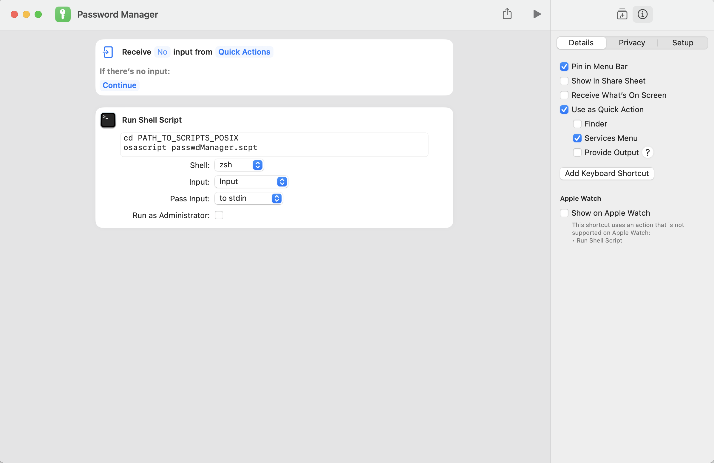
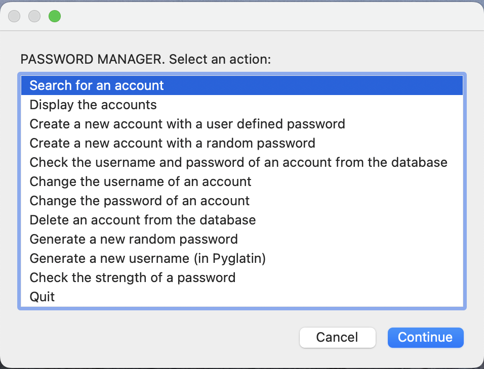

# Password Manager for MacOS

## Installation guide

### Files and folders setup

Download or clone the project folder. Copy the path name of the folder you created in HFS and POSIX (PATH_TO_SCRIPTS_HFS, PATH_TO_SCRIPTS_POSIX). You will use the path name later.

Create a hidden folder called .passwords (or something like that) somewhere in your system. Copy the path name of that folder both in HFS and POSIX (PATH_TO_SYSADMIN_HFS, PATH_TO_SYSADMIN_POSIX). You will use the path names later.

Move the files:

- **sysadmin.txt**
- **appList.txt**
- **userList.txt**
- **passwdList.txt**

into that hidden folder you just created.

Open the text file **sysadmin.txt** and replace the blank password with your own sysadmin password. You can choose whatever password you want. WARNING! _Do not open any of the other text files unless you are sure of what you are doing._ Did you open them? Do not open them.

Open the file **passwdManager.scpt** in _Script Editor_. Replace the path names to the password folder and the scripts folder with your own path names. You can find where to add this information by typing in the _Script Editor_ search bar:
_SET THE PATHS TO SCRIPTS AND DATA FILES IN HFS AND POSIX_.

Locate _the path to python_ in your system in POSIX and copy that information. Add that path into the file **passwdManager.scpt**.
You can find where to add this information by typing in the _Script Editor_ search bar:
_SET THE PATH TO PYTHON IN POSIX_.

If you are unsure where python is located you can try typing:

```
% which python
```

into the terminal.

The app works and it is ready to go, but to make it easier to use you should add it to _Shortcuts.app_.

### _OPTIONAL:_ Add the script to _Shortcuts.app_

Open the **Shortcuts.app**. Create a new shortcut called **Password Manager**.

- Go to **Details** and make the shortcut a quick action.
- Deselect all input to receive no input from quick actions.
- Add **Run Shell Script**. Add the code:

```
cd PATH_TO_SCRIPTS_POSIX
osascript passwdManager.scpt
```

_PATH_TO_SCRIPTS_POSIX_ is of the form: /Users/MacSuperUser/Desktop/MyScriptsFolder or similar. Notice that there is no final forward slash. It is the same path as before except the final forward slash.



Save the Shortcuts app and you are good to go.

### Uninstallation

Delete all the files and folders related to the app and delete the shortcuts app.

### Compatibility

MacOS Ventura



All rights reserved **Jouni Rantanen**.
